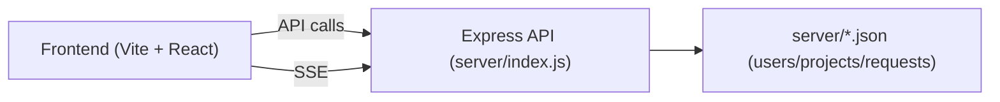

# DevConnect

DevConnect is a lightweight prototype of a developer collaboration platform. It includes a React + Vite frontend and a small Express-based backend used as a local mock API for authentication (GitHub/Google OAuth flows), projects, users, and collaboration requests. The project demonstrates UI components, routing, state via React context, a mock JSON-backed API, and real-time invites via Server-Sent Events (SSE).

## Key Features

- Frontend built with React (Vite) and Tailwind CSS
- Client-side routing with `react-router-dom`
- Reusable UI components (sidebar, navbar, cards, dashboard widgets)
- Authentication flows using GitHub and Google OAuth (server-side exchange)
- Mock backend with Express reading/writing JSON files (`users.json`, `projects.json`, `requests.json`)
- CRUD APIs for users, projects, and collaboration requests
- Real-time invite delivery using Server-Sent Events (SSE)

## Tech Stack

- Frontend: React 18, Vite, Tailwind CSS, Framer Motion, Recharts
- Backend: Node.js, Express, CORS
- Dev tooling: Vite, concurrently

## Repo Layout

- [DEVCONNECT](DEVCONNECT)
  - [package.json](package.json) — scripts & dependencies
  - [vite.config.js](vite.config.js)
  - [postcss.config.js](postcss.config.js)
  - [tailwind.config.js](tailwind.config.js)
  - [index.html](index.html)
  - [server/index.js](server/index.js) — mock API server with OAuth, SSE, and JSON persistence
  - [server/users.json](server/users.json) — persisted users (JSON)
  - [server/projects.json](server/projects.json) — persisted projects (JSON)
  - [server/requests.json](server/requests.json) — persisted collaboration requests (JSON)
  - [src/](src) — React source
    - [main.jsx](src/main.jsx) — entry point
    - [App.jsx](src/App.jsx) — routing and App providers
    - [index.css](src/index.css) — Tailwind imports and global styles
    - [components/] — UI components and layout (Sidebar, Navbar, Dashboard, cards...)
    - [pages/] — Page views (Landing, Login, Dashboard, Projects, Profile, etc.)
    - [context/] — `AppContext` and `AuthContext` for app state and auth
    - [utils/api.js](src/utils/api.js) — helper to call the backend APIs

## Running Locally

1. Install dependencies

```bash
npm install
```

2. Create a `.env` file at the project root (optional; defaults are provided for local development):

```
GITHUB_CLIENT_ID=your_github_client_id
GITHUB_CLIENT_SECRET=your_github_client_secret
GOOGLE_CLIENT_ID=your_google_client_id
GOOGLE_CLIENT_SECRET=your_google_client_secret
BACKEND_URL=http://localhost:3001
FRONTEND_URL=http://localhost:5174
PORT=3001
```

3. Start the frontend dev server:

```bash
npm run dev
```

4. Start the mock backend server:

```bash
npm run server
```

5. Start both concurrently:

```bash
npm run dev:all
```

Open the app at `http://localhost:5174` (or the port printed by Vite).

## Available npm Scripts

- `npm run dev` — start Vite dev server
- `npm run server` — start Express mock API server
- `npm run dev:all` — run frontend and backend concurrently
- `npm run build` — build production assets
- `npm run preview` — preview production build

## Environment Variables

- `GITHUB_CLIENT_ID`, `GITHUB_CLIENT_SECRET` — GitHub OAuth app credentials
- `GOOGLE_CLIENT_ID`, `GOOGLE_CLIENT_SECRET` — Google OAuth credentials
- `BACKEND_URL` — backend base URL used in callbacks (default: `http://localhost:3001`)
- `FRONTEND_URL` — frontend base URL (default: `http://localhost:5174`)
- `PORT` — backend server port (default: `3001`)

> Note: For local development you can leave the secrets empty — the server uses placeholder values. To test real OAuth flows you must register OAuth apps with GitHub/Google and set the callback URLs to `http://localhost:3001/auth/github/callback` and `http://localhost:3001/auth/google/callback` respectively.

## Backend API Summary

- `GET /auth/github` — returns GitHub authorize URL
- `GET /auth/github/callback?code=...` — GitHub callback exchange; redirects to frontend with `token`
- `GET /auth/google` — returns Google authorize URL
- `GET /auth/google/callback?code=...` — Google callback exchange; redirects to frontend with `token`
- `POST /auth/verify` — verify session token and return user
- `POST /auth/logout` — simple logout endpoint

Users
- `GET /users` — list users
- `GET /users/:id` — get user by id
- `PUT /users/:id` — update user profile (limited fields)
- `DELETE /users/:id` — delete user

Projects
- `POST /projects` — create project
- `GET /projects` — list projects (optional query: `owner`, `visibility`)
- `GET /projects/:id` — get project
- `PUT /projects/:id` — update project
- `DELETE /projects/:id` — delete project

Requests (collaboration invites)
- `POST /requests` — create request/invite
- `GET /requests` — list requests (query: `to`, `from`, `projectId`, `status`)
- `GET /requests/:id` — get a specific request
- `PUT /requests/:id` — update request (status etc.)
- `DELETE /requests/:id` — delete request

Invites (SSE)
- `GET /invites/stream/:username` — SSE endpoint to receive real-time invites
- `POST /invites/send` — server routes invite to online user or queues it

## Notes & Next Steps

- Data is persisted in plain JSON files under `server/` for simplicity; for production, swap to a proper database.
- Session tokens in the mock server are base64 blobs — replace with signed JWTs for production.
- Add tests and CI, and improve error handling and validation on the API.

## Where to Look

- App entry and routing: [src/App.jsx](src/App.jsx)
- Frontend entry: [src/main.jsx](src/main.jsx)
- Mock API and OAuth flows: [server/index.js](server/index.js)
- Data files: [server/users.json](server/users.json), [server/projects.json](server/projects.json), [server/requests.json](server/requests.json)

---

If you'd like, I can:
- Add a short `CONTRIBUTING.md` with development notes
- Expand the README with diagrams or screenshots
- Create Postman/Insomnia collection for the API

## System Requirements

- Node.js 18+ (LTS recommended)
- npm 9+ or Yarn
- Tested on Windows/macOS/Linux

## .env Example

Copy or create a `.env` file at the project root using the values from [`.env.example`](.env.example).

## Quick API Examples (curl)

Verify session (replace `<TOKEN>`):

```bash
curl -X POST http://localhost:3001/auth/verify \
  -H "Content-Type: application/json" \
  -d '{"token":"<TOKEN>"}'
```

Create a project (example):

```bash
curl -X POST http://localhost:3001/projects \
  -H "Content-Type: application/json" \
  -d '{"id":101,"title":"Example","owner":"alice"}'
```

List projects:

```bash
curl http://localhost:3001/projects
```

Create a request/invite:

```bash
curl -X POST http://localhost:3001/requests \
  -H "Content-Type: application/json" \
  -d '{"id":1,"from":"alice","to":"bob","projectId":101}'
```

## Server-Sent Events (SSE) example

Use this small JavaScript snippet to subscribe to invites for `bob`:

```javascript
const evtSource = new EventSource('http://localhost:3001/invites/stream/bob');
evtSource.onmessage = e => console.log('invite:', JSON.parse(e.data));
evtSource.onerror = e => console.error('SSE error', e);
```

To send an invite via the API:

```bash
curl -X POST http://localhost:3001/invites/send \
  -H "Content-Type: application/json" \
  -d '{"id":123,"from":"alice","to":"bob","projectId":101,"message":"Join my project"}'
```

## OAuth testing guide

1. Register OAuth apps:
   - GitHub: create a new OAuth App and set the callback URL to `http://localhost:3001/auth/github/callback`.
   - Google: create OAuth credentials and set the redirect URI to `http://localhost:3001/auth/google/callback`.
2. Add credentials to a `.env` file (see `.env.example`).
3. Start backend: `npm run server` and frontend: `npm run dev`.
4. Use the UI Login buttons or call `GET /auth/github` and `GET /auth/google` to obtain authorize URLs.

## Data seed / reset

You can reset the server JSON data to empty arrays using the included script:

```bash
node server/scripts/reset_data.js
```

This will clear `server/users.json`, `server/projects.json`, and `server/requests.json` and reinitialize them with empty arrays.

## Postman / Insomnia

A basic Postman collection is provided at `docs/postman_collection.json` — import it into Postman or Insomnia to quickly test endpoints.

## Security & Production Notes

- Replace base64 session tokens with signed JWTs for production.
- Move from JSON files to a production database (Postgres, MongoDB, etc.).
- Never commit secrets — use environment variables or a secret manager.

## License

This project is available under the MIT License. See [LICENSE](LICENSE) for details.

## Contributing

See [CONTRIBUTING.md](CONTRIBUTING.md) for contribution guidelines, code style, and PR process.

## Authors & Contact

- Maintainer: DevConnect contributors

## Roadmap / Known issues

- Real authentication should use secure sessions/JWTs.
- Replace file storage with a DB and add migrations.
- Add tests and CI.

## Architecture (simple diagram)



## Full end-to-end walkthrough

This section helps a new developer run, explore, and extend the project from scratch.

1. Clone the repository and install dependencies:

```bash
git clone <repo-url>
cd DEVCONNECT
npm install
```

2. Create your `.env` file from the example:

```bash
cp .env.example .env
# then fill in client IDs/secrets if testing OAuth
```

3. Reset test data (optional):

```bash
npm run reset-data
```

4. Start both servers for local dev:

```bash
npm run dev:all
```

5. Visit the frontend at `http://localhost:5174`. Use the UI to create projects, view dashboards, and test invites.

6. Test SSE (open browser devtools console) and trigger an invite via the API or UI.

## Example request/response

Create project request (POST /projects)

Request body:

```json
{
  "id": 101,
  "title": "Example Project",
  "owner": "alice",
  "description": "Short description"
}
```

Sample response (201):

```json
{
  "project": {
    "id": 101,
    "title": "Example Project",
    "owner": "alice",
    "description": "Short description",
    "createdAt": "2026-04-21T00:00:00.000Z"
  }
}
```

Verify session (POST /auth/verify)

Request body:

```json
{ "token": "<base64-session-token>" }
```

Response (200):

```json
{ "user": { "id": 1, "username": "alice", "email": "alice@example.com" } }
```

## Running the reset-data script

Use the npm script added to `package.json` to reset JSON data files:

```bash
npm run reset-data
```

This runs `server/scripts/reset_data.js` and clears `server/users.json`, `server/projects.json`, and `server/requests.json`.

## Screenshots / Demo

Add screenshots or GIFs to `docs/screenshots/` and reference them here. Recommended captures:

- Landing page
- Dashboard view
- Create project flow
- Invite / SSE demo

If you want, I can capture and add placeholder images and update the README.

## Deployment notes

- Build the frontend: `npm run build` and serve the `dist` folder on a static host (Vercel, Netlify).
- Host the backend on any Node-capable host (Render, Heroku, DigitalOcean). Set `BACKEND_URL` and `FRONTEND_URL` env vars appropriately and use a persistent DB in production.

## Tests & CI

No automated tests are present yet. Recommended next steps:

- Add unit tests for critical utility functions and API handlers.
- Add a GitHub Actions workflow to run lint/tests and to build the frontend on PRs.

## CHANGELOG

See `CHANGELOG.md` for release notes. (If you want, I can start a changelog file and populate initial entries.)


